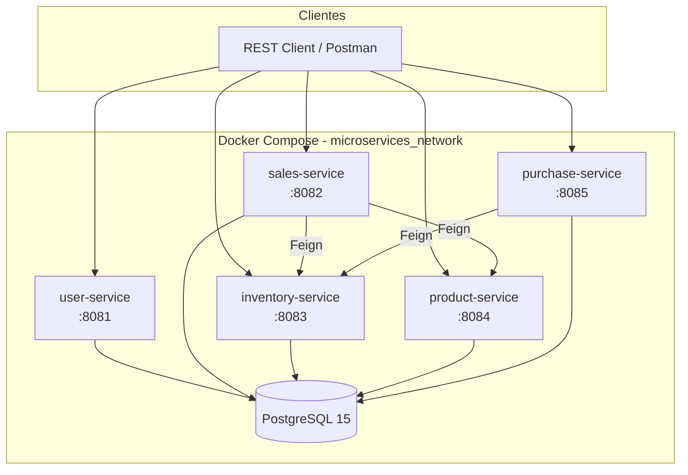
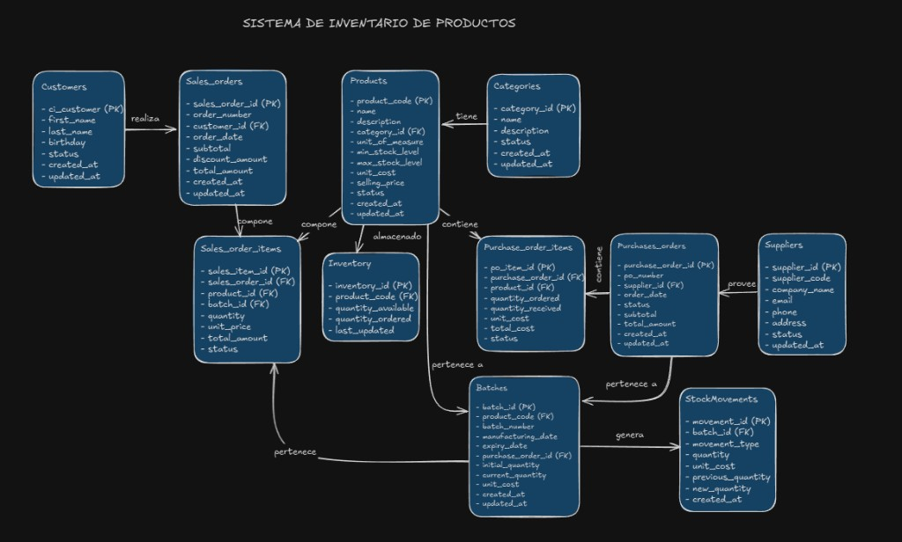

# Product Inventory System

Sistema de gestión de inventario orientado a productos, compras, ventas, lotes y movimientos de stock. El repositorio incluye una **arquitectura de microservicios** desplegable con Docker y una **aplicación monolítica de referencia** que implementa el dominio completo del modelo relacional.


---

## Tabla de contenidos

- [Descripción](#descripción)
- [Arquitectura de microservicios](#arquitectura-de-microservicios)
- [Modelo de datos](#modelo-de-datos)
- [Tecnologías utilizadas](#tecnologías-utilizadas)
- [Estructura del repositorio](#estructura-del-repositorio)
- [Requisitos previos](#requisitos-previos)
- [Instrucciones de ejecución](#instrucciones-de-ejecución)
- [Documentación de API](#documentación-de-api)
- [Capturas y diagramas](#capturas-y-diagramas)
- [Roadmap](#roadmap)

---

## Descripción

El proyecto cubre el ciclo operativo de un almacén o punto de venta:

| Dominio | Capacidades |
|---------|-------------|
| **Catálogo** | Productos, categorías, precios y niveles mín/máx de stock |
| **Compras** | Órdenes de compra, proveedores y recepción de mercadería |
| **Inventario** | Stock disponible, lotes (batches) y movimientos |
| **Ventas** | Órdenes de venta, ítems por lote y clientes |
| **Usuarios** | Gestión de vendedores / usuarios del sistema |

La versión **microservicios** separa responsabilidades por bounded context y comunica servicios vía **OpenFeign** (ventas y compras consultan inventario y productos). La carpeta **`demo/`** concentra la lógica de negocio en una sola aplicación Spring Boot, útil para pruebas rápidas y documentación Swagger.

---

## Arquitectura de microservicios

Los servicios activos en `docker-compose` comparten una base PostgreSQL y una red interna Docker. Las ventas y compras orquestan llamadas HTTP a inventario y catálogo.



### Servicios y puertos (por defecto)

| Servicio | Puerto host | Responsabilidad |
|----------|-------------|-----------------|
| `user-service` | 8081 | Usuarios / vendedores |
| `sales-service` | 8082 | Ventas y detalle de órdenes |
| `inventory-service` | 8083 | Stock, lotes y movimientos |
| `product-service` | 8084 | Productos y categorías |
| `purchase-service` | 8085 | Compras y proveedores |
| `postgres` | 5432 | Persistencia compartida |

### Componentes en evolución

En `microservices/` también existen módulos para un stack cloud más completo (no incluidos aún en el `docker-compose` principal):

| Módulo | Rol |
|--------|-----|
| `api-gateway` | Punto de entrada único y seguridad |
| `discovery-service` | Registro de servicios (Eureka) |
| `config-server` | Configuración centralizada |
| `oauth-server` | Autenticación OAuth2 |
| `stock-microservice` / `booking-microservice` | Stock y reservas (experimentales) |

---

## Modelo de datos

El diseño relacional contempla clientes, órdenes de venta, productos por categoría, inventario, compras a proveedores, lotes y movimientos de stock.



Entidades principales: **Customers**, **Sales_orders**, **Sales_order_items**, **Products**, **Categories**, **Inventory**, **Purchase_orders**, **Purchase_order_items**, **Suppliers**, **Batches**, **StockMovements**.

---

## Tecnologías utilizadas

| Capa | Stack |
|------|--------|
| Lenguaje | Java 17 |
| Framework | Spring Boot 3.2.3 |
| Persistencia | Spring Data JPA, Hibernate, Flyway (migraciones en purchase-service) |
| Base de datos | PostgreSQL 15 |
| Comunicación entre servicios | Spring Cloud OpenFeign |
| API docs (demo) | SpringDoc OpenAPI 3 |
| Build | Maven |
| Contenedores | Docker, Docker Compose |
| Cloud (módulos opcionales) | Spring Cloud Netflix Eureka, Config Server, API Gateway |

---

## Estructura del repositorio

```
product-inventory-system/
├── README.md                 # Este archivo
├── docs/
│   └── erd.png               # Diagrama entidad-relación
├── demo/                     # Monolito Spring Boot + Swagger
│   ├── src/
│   ├── docker-compose.yml
│   └── README.md
└── microservices/
    ├── docker-compose.yml    # Orquestación de microservicios
    ├── .env.example
    ├── user-service/
    ├── sales-service/
    ├── inventory-service/
    ├── product-service/
    ├── purchase-service/
    ├── api-gateway/          # Infraestructura (WIP)
    ├── discovery-service/
    └── ...
```

---

## Requisitos previos

- [JDK 17](https://adoptium.net/)
- [Maven 3.8+](https://maven.apache.org/)
- [Docker Desktop](https://www.docker.com/products/docker-desktop/) (recomendado para microservicios)
- Git

---

## Instrucciones de ejecución

### Opción 1 — Ejecución de los microservicio (con Docker)

```bash
cd microservices

# 1. Configurar variables de entorno
cp .env.example .env
# Edita .env y define una contraseña segura para POSTGRES_PASSWORD

# 2. Levantar todos los servicios
docker-compose up --build

# 3. Verificar que los contenedores estén activos
docker-compose ps
```

**Probar un endpoint de ejemplo** (productos):

```bash
curl http://localhost:8084/api/products
```

**Detener el entorno:**

```bash
docker-compose down
# Eliminar volúmenes de datos:
docker-compose down -v
```

### Opción 2 — Demo monolítica (desarrollo y Swagger)

```bash
cd demo

# Con Docker (app + PostgreSQL en puerto 8080)
docker-compose up --build

# O en local: levantar PostgreSQL y ejecutar
mvn spring-boot:run
```

Consulta el detalle en [demo/README.md](demo/README.md).

### Ejecución local de un microservicio (sin Docker)

```bash
cd microservices/product-service
mvn spring-boot:run
```

Necesitas PostgreSQL en ejecución y variables `SPRING_DATASOURCE_*` configuradas según `application.yml` del servicio.

---

## Documentación de API

| Variante | Swagger UI | OpenAPI |
|----------|------------|---------|
| **Demo** (`demo/`) | http://localhost:8080/swagger-ui.html | http://localhost:8080/v3/api-docs |
| **Microservicios** | Por servicio (añadir SpringDoc si se requiere UI unificada) | Endpoints REST bajo `/api/*` |

Rutas base en microservicios:

- `GET /api/products`, `/api/categories` → **product-service** (`8084`)
- Inventario y lotes → **inventory-service** (`8083`)
- Ventas → **sales-service** (`8082`)
- Compras y proveedores → **purchase-service** (`8085`)
- Usuarios → **user-service** (`8081`)

---

## Capturas y diagramas

| Recurso | Ubicación |
|---------|-----------|
| Diagrama ER | [docs/erd.png](docs/erd.png) |
| Arquitectura microservicios | Diagrama Mermaid en este README |
| Swagger (demo) | Ejecutar `demo` y abrir `http://localhost:8080/swagger-ui.html` |

---

## Roadmap

- [ ] Integrar `api-gateway` y `discovery-service` en `docker-compose`
- [ ] Documentación OpenAPI unificada para todos los microservicios
- [ ] Separar esquemas de base de datos por servicio (database per service)
- [ ] Pruebas de integración con Testcontainers
- [ ] CI/CD con GitHub Actions

---

## Licencia

Proyecto personal / portafolio.

---

## Autor

**Noemi** — Sistema de Inventario de Productos  
Si este repositorio te resultó útil en una revisión técnica, puedes abrir un issue o sugerir mejoras vía pull request.
